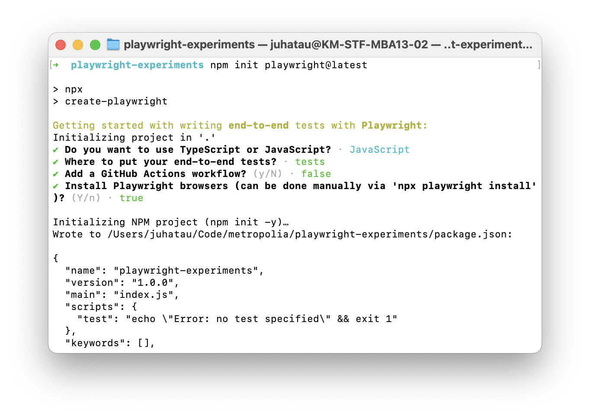
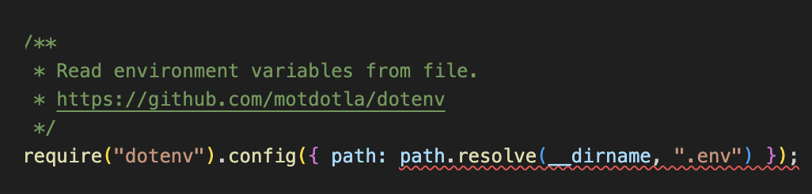
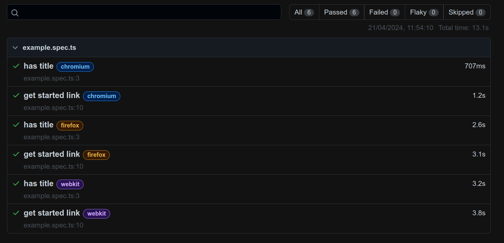
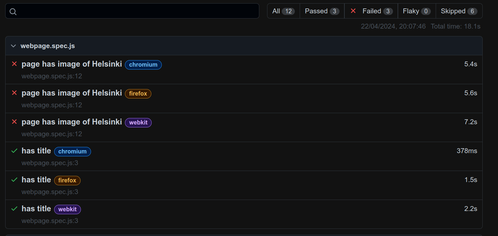
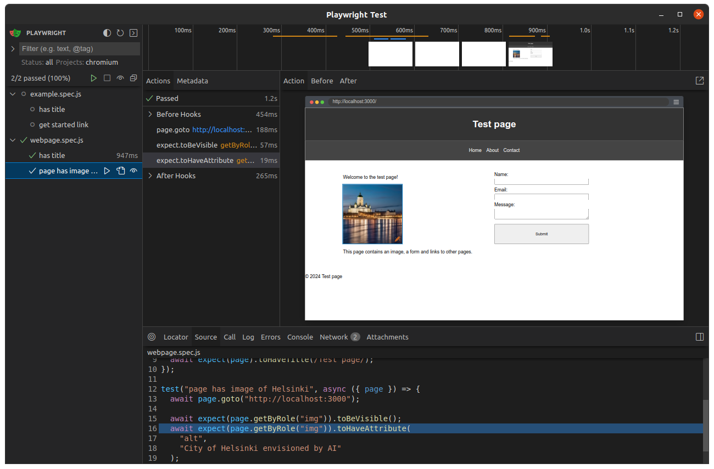

# End-to-end testing with Playwright

Playwright is a Node.js library to automate the browser, developed by Microsoft. Playwright supports multiple browsers, including Chrome, Firefox, and WebKit. It also supports multiple programming languages, including JavaScript, Python, and C#. It is used to build end-to-end tests for web applications.

Playwright provides a simple and powerful API to interact with the browser, navigate to pages, search for elements, and interact with the elements. It also provides a test runner to run the test cases, generate reports, and store the test results, as well as tools to debug the test cases.

As Playwright is backed by Microsoft, the documentation is world-class and the tool is actively developed. It is a good choice for end-to-end testing, especially for web applications.

- [Playwright documentation](https://playwright.dev/docs/intro)
- [NPM package](https://www.npmjs.com/package/playwright)

## Other tools

Other similar tools exist, such as Puppeteer and Cypress. Playwright has been gaining much popularity in recent years, as is visible in [npm trends](https://npmtrends.com/cypress-vs-playwright-vs-puppeteer).

One of the main benefits (along many) with Playwright is that it executes the tests in real browsers, through their APIs, using Node.js. The browsers run in headless mode in the background. Other libraries utilise similar approaches, for example Cypress runs tests inside a browser (Chrome).

As the tests are executed in a real browser, the tests are more reliable and closer to the real user experience. This is important when testing web applications, as the user interacts with the application through a web browser. We can also simulate different devices and screen sizes to ensure that the application works as expected in different scenarios.

If you are familiar or interested in Cypress, read this comparison between [Cypress and Playwright](https://testsigma.com/blog/playwright-vs-cypress/).

## Installation

To install Playwright, run the following npm command in your command line (CLI) terminal, in the root directory of your project. Note, this will not install playwright globally, only for the project where the command is run.

```bash
npm init playwright@latest
```

This setup tool will ask some basic questions. Choose JavaScript.



This will generate folders called `tests` and `tests-examples`, alongside with `playwright.config.js` file. It will also update`package.json` to include the necessary dependencies, and `.gitignore` file to ignore generated playwright files and node_modules.

The setup will also output helpful information about how to run the tests.

```bash
  npx playwright test
    Runs the end-to-end tests.

  npx playwright test --ui
    Starts the interactive UI mode.

  npx playwright test --project=chromium
    Runs the tests only on Desktop Chrome.

  npx playwright test example
    Runs the tests in a specific file.

  npx playwright test --debug
    Runs the tests in debug mode.

  npx playwright codegen
    Auto generate tests with Codegen.

We suggest that you begin by typing:

    npx playwright test

And check out the following files:
  - ./tests/example.spec.js - Example end-to-end test
  - ./tests-examples/demo-todo-app.spec.js - Demo Todo App end-to-end tests
  - ./playwright.config.js - Playwright Test configuration
```

Before continuing, try most of these commands and have a look at the tests folders. Double check package.json file to see the dependencies that were added.

Familiarize yourself with the documentation: [https://playwright.dev/docs/intro](https://playwright.dev/docs/intro)

### npm install & Playwright missing browsers

This step can be skipped when installing Playwright for the first time in a project with the `npm init playwright@latest` command.

When cloning a project already containing Playwright tests, the package dependency installation might not be enough. The Playwright browsers need to be installed as well by running the `npx playwright install` command.

```bash
npx playwright install
```

This will install the necessary browsers, such as Chrome, Firefox, and WebKit, to run the test cases. Note that these browsers are installed for Playwright, and they are not installed globally on the system for general use.

If you do not run this command, test cases will not be executed, instead you will see something like this:

```
Error: browserType.launch: Executable doesn't exist at /Users/juhatau/Library/Caches/ms-playwright/chromium-1112/chrome-mac/Chromium.app/Contents/MacOS/Chromium
╔═════════════════════════════════════════════════════════════════════════╗
║ Looks like Playwright Test or Playwright was just installed or updated. ║
║ Please run the following command to download new browsers:              ║
║                                                                         ║
║     npx playwright install                                              ║
║                                                                         ║
║ <3 Playwright Team                                                      ║
╚═════════════════════════════════════════════════════════════════════════╝
```

After the browsers are installed, the test cases can be executed.

## Basic configuration

After the initialisation, the `playwright.config.js` file will be generated. This file is used to configure the test runner, set the test environment, and define the test settings.

Based on the selections, the default config might look like this. We do not need to change anything for now.

```javascript
// @ts-check
const { defineConfig, devices } = require("@playwright/test");

/**
 * Read environment variables from file.
 * https://github.com/motdotla/dotenv
 */
// require('dotenv').config({ path: path.resolve(__dirname, '.env') });

/**
 * @see https://playwright.dev/docs/test-configuration
 */
module.exports = defineConfig({
  testDir: "./tests",
  /* Run tests in files in parallel */
  fullyParallel: true,
  /* Fail the build on CI if you accidentally left test.only in the source code. */
  forbidOnly: !!process.env.CI,
  /* Retry on CI only */
  retries: process.env.CI ? 2 : 0,
  /* Opt out of parallel tests on CI. */
  workers: process.env.CI ? 1 : undefined,
  /* Reporter to use. See https://playwright.dev/docs/test-reporters */
  reporter: "html",
  /* Shared settings for all the projects below. See https://playwright.dev/docs/api/class-testoptions. */
  use: {
    /* Base URL to use in actions like `await page.goto('/')`. */
    // baseURL: 'http://127.0.0.1:3000',

    /* Collect trace when retrying the failed test. See https://playwright.dev/docs/trace-viewer */
    trace: "on-first-retry",
  },

  /* Configure projects for major browsers */
  projects: [
    {
      name: "chromium",
      use: { ...devices["Desktop Chrome"] },
    },

    {
      name: "firefox",
      use: { ...devices["Desktop Firefox"] },
    },

    {
      name: "webkit",
      use: { ...devices["Desktop Safari"] },
    },

    /* Test against mobile viewports. */
    // {
    //   name: 'Mobile Chrome',
    //   use: { ...devices['Pixel 5'] },
    // },
    // {
    //   name: 'Mobile Safari',
    //   use: { ...devices['iPhone 12'] },
    // },

    /* Test against branded browsers. */
    // {
    //   name: 'Microsoft Edge',
    //   use: { ...devices['Desktop Edge'], channel: 'msedge' },
    // },
    // {
    //   name: 'Google Chrome',
    //   use: { ...devices['Desktop Chrome'], channel: 'chrome' },
    // },
  ],

  /* Run your local dev server before starting the tests */
  // webServer: {
  //   command: 'npm run start',
  //   url: 'http://127.0.0.1:3000',
  //   reuseExistingServer: !process.env.CI,
  // },
});
```

Although we might want to remove the comments on the `webserver` config.

```javascript
/* Run your local dev server before starting the tests */
webServer: {
  command: "npm run start",
  url: "http://127.0.0.1:3000",
  reuseExistingServer: !process.env.CI,
},
```

Now Playwright will start the local server before running the tests. This is useful when the tests need to interact with the web application, which is running on a local server. It will execute the `start` script defined in the `package.json` file.

```json
{
  "scripts": {
    "start": "node index.js"
  }
}
```

Now we do not need to manually start our server when running the tests.

You can set the `command: "npm run start"` to be something else if you wish. Might be useful to start the dev server in watch mode, if tests fail because of the server having some bugs in it.

### Note about ports (this part only needed if port 3000 is already in use)

The default port often is 3000 for local development purposes. If you decide to change the port to something else (as I did, changing my local port to 3040 as 3000 had something else running), then you need to make sure the port change is reflected to all the configurations, test cases, server and possibly to the npm scripts.

Read about [environment parameters](https://playwright.dev/docs/test-parameterize) in Playwright documentation.

For now, let's add `.env` file to the root of the project with the following content (remember .gitignore). Before doing that, read [dotenv documentation](https://playwright.dev/docs/test-parameterize#env-files) and install the required `dotenv` package.

```
PORT=3040
```

In terminal:

```bash
npm install dotenv
```

Now you can uncomment the line `// require('dotenv').config({ path: path.resolve(__dirname, '.env') });` from the `playwright.config.js` file. This will load the environment variables from the `.env` file to the test cases.

And finally edit `playwright.config.js` file to use the port from the environment variables.

```javascript
webServer: {
  command: "npm run start",
  url: `http://127.0.0.1:${process.env.PORT}`,
  reuseExistingServer: !process.env.CI,
},
```

Have a look at the example test suite in [examples/webpage/tests/webpage.spec.js](examples/webpage/tests/webpage.spec.js)

### Are you seeing path error in your editor?



If you are seeing this error in the editor, you can fix it by adding the following to the top of the `playwright.config.js` file:

```javascript
const path = require("path");
```

## Running tests

Now that the initial example test cases have been installed, they can be executed by running:

```bash
npx playwright test
```

This will run the tests in the `tests` folder.

Now, let's add npm test script to `package.json`:

```json
{
  "scripts": {
    "test": "playwright test"
  }
}
```

If you already have `scripts` in your `package.json`, just add the `test` script to it:

```json
{
  "scripts": {
    "start": "node index.js",
    "dev": "nodemon index.js",
    "test": "playwright test"
  }
}
```

Now, you can run the tests by running:

```bash
npm test
```

Note that you can still use the `npx playwright test` command to run the tests, and the playwright documentation only mentions the `npx` command. However, adding the npm script can be more convenient and works as a documentation and a shortcut for the command. Most projects will have their test commands in the `package.json` file.

After running the test cases, a report will be generated in the `playwright-results` folder. If the tests fail, then browser is opened to show the test results.

For the example tests, the test cases should pass. To see the test report, run `npx playwright show-report`, which will open the browser with the test report.

The example test report should look like this:


If all is well, the individual test cases should pass and the whole test suite should pass.

Example of passing test suite:

```bash
npm run test


> webpage@1.0.0 test
> playwright test


Running 12 tests using 2 workers
  6 skipped
  6 passed (15.1s)

To open last HTML report run:

  npx playwright show-report
```

If the tests fail, the report will show the failed test cases, which might look like this:



Example of a failing test case:

```bash
  3) [webkit] › webpage.spec.js:12:5 › page has image of Helsinki ──────────────────────────────────

    Error: Timed out 5000ms waiting for expect(locator).toHaveAttribute(expected)

    Locator: getByRole('img')
    Expected string: "Helsinki"
    Received string: "City of Helsinki envisioned by AI"
    Call log:
      - expect.toHaveAttribute with timeout 5000ms
      - waiting for getByRole('img')
      -   locator resolved to 
      -   unexpected value "City of Helsinki envisioned by AI"
      -   locator resolved to 
      -   unexpected value "City of Helsinki envisioned by AI"
      -   locator resolved to 
      -   unexpected value "City of Helsinki envisioned by AI"
      -   locator resolved to 
      -   unexpected value "City of Helsinki envisioned by AI"
      -   locator resolved to 
      -   unexpected value "City of Helsinki envisioned by AI"
      -   locator resolved to 
      -   unexpected value "City of Helsinki envisioned by AI"
      -   locator resolved to 
      -   unexpected value "City of Helsinki envisioned by AI"
      -   locator resolved to 
      -   unexpected value "City of Helsinki envisioned by AI"
      -   locator resolved to 
      -   unexpected value "City of Helsinki envisioned by AI"


      14 |
      15 |   await expect(page.getByRole("img")).toBeVisible();
    > 16 |   await expect(page.getByRole("img")).toHaveAttribute("alt", "Helsinki");
         |                                       ^
      17 | });
      18 |

        at /home/juhataur/Code/metropolia/end-to-end/examples/webpage/tests/webpage.spec.js:16:39
```

### Starting both backend and frontend

If you have backend and frontend in separate systems (folders, git repos etc), you can configure Playwright to run each of these separately. Playwright will start the servers in separate processes, and run the tests against them.

Edit `playwright.config.js` file, change webServer configuration to be an array of objects. Each object should have a `command` and `url` properties. The `command` should be the command to start the server, and the `url` should be the URL of the server.

```javascript
webServer: [
  {
    command: "cd backend/ && npm run start",
    url: `http://127.0.0.1:${process.env.BACKEND_PORT}`,
    reuseExistingServer: !process.env.CI,
  },
  {
    command: "cd frontend/ && npm run start",
    url: `http://127.0.0.1:${process.env.FRONTEND_PORT}`,
    reuseExistingServer: !process.env.CI,
  },
],
```

Adding `BACKEND_PORT` and `FRONTEND_PORT` to the `.env` file might be a good idea.

```
PORT=3040
BACKEND_PORT=3001
FRONTEND_PORT=3000
```

They can also be hardcoded into the `playwright.config.js` file.

```javascript
webServer: [
  {
    command: "cd backend/ && npm run start",
    url: `http://localhost:3001`,
    reuseExistingServer: !process.env.CI,
  },
  {
    command: "cd frontend/ && npm run start",
    url: `http://localhost:3000`,
    reuseExistingServer: !process.env.CI,
  },
],
```

## Real browsers

For each test case, playwright will start multiple browsers, run the test cases, and generate a report. The report will show the test case name, the browser used, the status of the test case, and the time it took to run the test case. By default playwright will run the tests in three browsers, Chrome, Firefox, and WebKit. It can be configured to run the tests in a specific browser, or multiple browsers, or specific devices.

Having the tests running on real browsers is a benefit, as the tests are closer to the real user experience. Any browser specific issues can be caught early, and the tests can be run in different browsers to ensure that the application works as expected in different scenarios.

### Specific browser

To run the tests in a specific browser, use the `--project` flag:

```bash
npx playwright test --project=chromium
```

Or

```bash
npm test -- --project=chromium
```

Or configure the `playwright.config.js` file to run the tests in a specific browser:

```javascript
import { defineConfig, devices } from "@playwright/test";

export default defineConfig({
  projects: [
    // ...
    {
      name: "Microsoft Edge",
      use: { ...devices["Desktop Edge"], channel: "msedge" }, // or 'msedge-dev'
    },
  ],
});
```

Read more about running tests in different browsers: [https://playwright.dev/docs/browsers](https://playwright.dev/docs/browsers)

## Tests in parallel

Playwright can run the test cases in parallel, which can save time and speed up the test execution. By default, playwright will run the test cases in parallel, using multiple workers. The default values in the configuration file will suffice for most projects, and for us.

The test cases are executed in worker processes, which are OS processes and are running independently. Upside is performance, downside is that the test cases can't share data between each other. But, this is a good thing, as the test cases should be independent of each other.

If you need to limit the number of workers, you can do so in the `playwright.config.js` file:

```javascript
import { defineConfig } from "@playwright/test";

export default defineConfig({
  workers: 2,
});
```

Or by the CLI command: `npx playwright test --workers=2`

Given that the tests are executed in parallel and independently from each other, in cases where we need to have some shared data between the test cases, we need to use the setup and teardown behavior. More in the docs: [https://playwright.dev/docs/test-global-setup-teardown](https://playwright.dev/docs/test-global-setup-teardown)

Read more about running tests in parallel: [https://playwright.dev/docs/test-parallel](https://playwright.dev/docs/test-parallel)

## Interactive & UI modes for running

Playwright provides many tools to make developers life easier, such as the interactive mode to run and debug tests in the browser. To run the tests in ui mode, run:

```bash
npx playwright test --ui
```

Or

```bash
npm test -- --ui
```

This will open the browser with the test runner, where you can run the tests, see the test results, and debug the tests. This is useful when you want to see the test results in real-time, or when you want to debug the test cases.

It might look something like this:



In the UI mode, you can run all test cases or only the ones which are of some interest to you. You can make changes to the test cases and to the source code and rerun the tests. You can also see the test results, the test report, and the test logs.

Read more in [https://playwright.dev/docs/running-tests](https://playwright.dev/docs/running-tests)

## Writing test cases

To write test cases, create a new file in the `tests` folder. The file should have the `.spec.js` extension. For example, `webpage.spec.js`.

In the test file, import the necessary functions from Playwright; `test` and `expect`. The test function is used to define the test cases, and the expect function is used to define the assertions (expected results).

An initial test case might look like this:

```javascript
import { expect, test } from "@playwright/test";

test("has title", async ({ page }) => {
  await page.goto("http://localhost:3000");
  // test for full title (fails)
  // await expect(page).toHaveTitle("Test page");

  // test that title contains "Test page" as substring
  await expect(page).toHaveTitle(/Test page/);
});

test("page has image of Helsinki", async ({ page }) => {
  await page.goto("http://localhost:3000");

  await expect(page.getByRole("img")).toBeVisible();
  await expect(page.getByRole("img")).toHaveAttribute(
    "alt",
    "City of Helsinki envisioned by AI"
  );
});
```

In this example test file, there are two test cases. The first test case checks that the page has a title that contains the string "Test page". The second test case checks that the page has an image with the alt attribute "City of Helsinki envisioned by AI".

### GetByRole

The image in the second test case is searched with the [`getByRole`](https://playwright.dev/docs/api/class-page#page-get-by-role) function, which searches for an element by its role. The role of the image is "img", which is the role of an image element in HTML. Using the role selector is a good practice, as it utilises the accessibility features of the web page. If an element can't be found by role, can a screen reader find it?

### GetByText

Another useful function is [`getByText`](https://playwright.dev/docs/api/class-page#page-get-by-text), which searches for an element by its text content. This can be useful when searching for elements that contain specific text, such as buttons, links, and headings.

```javascript
test("page has button with text 'Click me'", async ({ page }) => {
  await page.goto("http://localhost:3000");

  await expect(page.getByText("Click me")).toBeVisible();
});
```

The above example test case checks that the page has a button with the text "Click me". The test case uses the `getByText` function to search for the button by its text content.

### GetByTestId

[`getByTestId`](https://playwright.dev/docs/api/class-page#page-get-by-test-id) searches for an element by its test id. Test id is an HTML attribute in the HTML source file, which can be used to help the test cases to find the elements. The test id is not visible to the user, and it is used only for testing purposes.

```html
<button data-testid="submit-button">Submit</button>
```

This HTML could be tested with the following JavaScript:

```javascript
test("page has button with test id 'submit-button'", async ({ page }) => {
  await page.goto("http://localhost:3000");

  await expect(page.getByTestId("submit-button")).toBeVisible();
});
```

### BeforeEach and afterEach

Often, we need to do some setup before running the test cases, and some cleanup after running the test cases. This can be done with the `beforeEach` and `afterEach` methods.

#### beforeEach

The `beforeEach` method is used to define the setup behavior, which is run before each test case. This behavior might include navigating to a page, filling a form, signing in, or any other test environment setup.

Example of navigating to a page before each test case:

```javascript
test.beforeEach(async ({ page }) => {
  await page.goto("http://localhost:3000");
});
```

Integrating `beforeEach` to a test case might look like this:

```javascript
import { expect, test } from "@playwright/test";

test.beforeEach(async ({ page }) => {
  await page.goto("http://localhost:3000");
});

test("has title", async ({ page }) => {
  // test for full title (fails)
  // await expect(page).toHaveTitle("Test page");

  // test that title contains "Test page" as substring
  await expect(page).toHaveTitle(/Test page/);
});

test("page has image of Helsinki", async ({ page }) => {
  await expect(page.getByRole("img")).toBeVisible();
  await expect(page.getByRole("img")).toHaveAttribute(
    "alt",
    "City of Helsinki envisioned by AI"
  );
});
```

Now we do not need to navigate to the page in each test case, as the `beforeEach` method will navigate to the page before each test case, saving us time and making the test cases more readable.

#### afterEach

Similarly, the `afterEach` method is used to define the cleanup behavior, which is run after each test case. This behavior might include logging out, deleting data, or any other test environment cleanup.

Example of user logout after each test case:

```javascript
test.afterEach(async ({ page }) => {
  await page.click('button[data-testid="logout-button"]');
});
```

Integrating `afterEach` to a test case might look like this:

```javascript
import { expect, test } from "@playwright/test";

test.beforeEach(async ({ page }) => {
  await page.goto("http://localhost:3000");
});

test.afterEach(async ({ page }) => {
  await page.click('button[data-testid="logout-button"]');
});

test("has title", async ({ page }) => {
  // test for full title (fails)
  // await expect(page).toHaveTitle("Test page");

  // test that title contains "Test page" as substring
  await expect(page).toHaveTitle(/Test page/);
});

test("page has image of Helsinki", async ({ page }) => {
  await expect(page.getByRole("img")).toBeVisible();
  await expect(page.getByRole("img")).toHaveAttribute(
    "alt",
    "City of Helsinki envisioned by AI"
  );
});
```

In this case, the user is logged out after each test case, ensuring that the user is logged out before the next test case is run. Note that in the next test case, the user might need to log in again, which can be done in the `beforeEach` method.

The `beforeEach` and `afterEach` methods can be used together to define the setup and cleanup behavior for the test cases, ensuring automation of the test environment setup and cleanup.

Read more in the playwright [beforeEach](https://playwright.dev/docs/api/class-test#test-before-each) and [afterEach](https://playwright.dev/docs/api/class-test#test-after-each) docs.

### More testing methods

More testing methods can be found in the [Methods section](https://playwright.dev/docs/api/class-page#methods) of the Playwright documentation.

### Page object

The `page` object has significant relevance in the test cases. It is used to interact with the browser, navigate to pages, and search for elements.

Read more about the `page` object: [https://playwright.dev/docs/api/class-page](https://playwright.dev/docs/api/class-page)

#### .goto() method

The [`page.goto()`](https://playwright.dev/docs/api/class-page#page-goto) method is used to navigate to a page. The method takes a URL as an argument, and it navigates to the page.

```javascript
test("has title", async ({ page }) => {
  await page.goto("http://localhost:3000");
  await expect(page).toHaveTitle("Test page");
});
```

#### .fill() method

The [`page.fill()`](https://playwright.dev/docs/api/class-page#page-fill) method is used to fill form fields (input, textarea, etc). The method takes two arguments. First one is the selector of the form field, and the second one is the value to fill the form field with.

```javascript
test("can fill form", async ({ page }) => {
  await page.goto("http://localhost:3000");

  await page.fill('input[name="name"]', "John Doe");
});
```

Note that calling .fill() method multiple times to the same input will overwrite any previous value. If you want to append text, in similar fashion as real user might, you might want to use [`pressSequentially()`](https://playwright.dev/docs/input#type-characters) method.

#### .click() method

The [`page.click()`](https://playwright.dev/docs/api/class-page#page-click) method is used to click on elements, such as buttons, links, and checkboxes. The method takes a selector as an argument, and it clicks on the element.

```javascript
test("can click button", async ({ page }) => {
  await page.goto("http://localhost:3000");

  await page.click('button[type="submit"]');
});
```

#### Checkboxes

Checkboxes can be checked with the `.check()` method and unchecked with the `.uncheck()` method.

```javascript
test("can check checkbox", async ({ page }) => {
  await page.goto("http://localhost:3000");

  await page.getByLabel("I agree to the terms above").check();
});
```

Read more in [https://playwright.dev/docs/input#checkboxes-and-radio-buttons](https://playwright.dev/docs/input#checkboxes-and-radio-buttons)

#### Radio buttons

Similarly to checkboxes, radio buttons can be checked with the `.check()` method.

```javascript
test("can check radio button", async ({ page }) => {
  await page.goto("http://localhost:3000");

  await page.getByLabel("XL").check();
});
```

#### Select elements

Select elements can be interacted with the [`.selectOption()`](https://playwright.dev/docs/input#select-options) method.

```javascript
test("can select option", async ({ page }) => {
  await page.goto("http://localhost:3000");

  await page.getByLabel("Choose a color").selectOption("blue");
});
```

#### Simulating clicks

Sometimes it is useful to simulate clicks, such as right-clicks, double-clicks, and normal clicks. The [`.click()`](https://playwright.dev/docs/input#mouse-click) method can be used for clicking around.

```javascript
test("can simulate right click", async ({ page }) => {
  await page.goto("http://localhost:3000");

  // normal click
  await page.getByRole("button").click();

  // right click
  await page.getByRole("button").click({ button: "right" });

  // double click
  await page.getByRole("button").dblclick();
});
```

#### Interaction with forms

To interact with forms, such as filling forms, submitting forms, and validating the results, use the `fill` function to fill the form fields, the `click` function to submit the form, and the `expect` function to validate the results.

```javascript
test("can fill and submit form", async ({ page }) => {
  await page.goto("http://localhost:3000");

  await page.fill('input[name="name"]', "John Doe");
  await page.fill('input[name="email"]', "john@doe.fi");
  await page.fill('textarea[name="message"]', "Hello, World!");

  await page.click('button[type="submit"]');
});
```

In this example test case, the form fields are filled with the `fill` function, and the form is submitted with the `click` function. The test case validates that the form can be filled, submitted, and the results can be displayed on the screen.

#### Validating the results

To validate the results, use the `expect` function to define the assertions. The `expect` function is used to define the expected results of the test cases. The `expect` function is used to define the assertions, such as `toHaveTitle` and `toHaveAttribute`.

```javascript
test("can fill and submit form", async ({ page }) => {
  await page.goto("http://localhost:3000");

  await page.fill('input[name="name"]', "John Doe");
  await page.fill('input[name="email"]', "john@doe.fi");
  await page.fill('textarea[name="message"]', "Hello, World!");

  await page.click('button[type="submit"]');

  await expect(page).toHaveText("Thank you for your message, John Doe!");
});
```

In the above example test case, the test case validates that the form can be filled, submitted, and the results can be displayed on the screen. The test case checks that the page has the text "Thank you for your message, John Doe!". This text can be on the same page as the form, or on a different page / URL.

To validate that the URL has changes, use the `toHaveURL` function:

```javascript
test("can fill and submit form", async ({ page }) => {
  await page.goto("http://localhost:3000");

  await page.fill('input[name="name"]', "John Doe");
  await page.fill('input[name="email"]', "john@doe.fi");
  await page.fill('textarea[name="message"]', "Hello, World!");

  await page.click('button[type="submit"]');

  await expect(page).toHaveURL("http://localhost:3000/thank-you");
});
```

In the above example test case, the test case checks that the URL has changed to `http://localhost:3000/thank-you` after the form has been submitted.

### Expect function

The `expect` function is used to define the assertions, which are the expected results of the test cases.

A simple example of how to use the `expect` function:

```javascript
test("has title", async ({ page }) => {
  await page.goto("http://localhost:3000");
  await expect(page).toHaveTitle("Test page");
});
```

In this example, we navigate to localhost and then expect the page to have the title "Test page". If the title is not "Test page", the test case will fail.

The expect function can be used to validate any kind of element on the page, such as text, attributes, and visibility. It is also used in other testing libraries, such as Jest and Cypress. It is a common way to define the expected results of the test cases.

Note: Unlike other libraries, the `await` keyword is placed before the except function, where as in for example Jest, the `await` keyword is placed inside the `expect` function.

Read more about the `expect` function: [https://playwright.dev/docs/api/class-playwrightassertions](https://playwright.dev/docs/api/class-playwrightassertions)

View [examples/webpage/tests/webpage.spec.js](examples/webpage/tests/webpage.spec.js)

### Assertions

#### Locator assertions

[Locator assertions](https://playwright.dev/docs/api/class-locatorassertions) are used to validate the elements on the page. The locator assertions can be used to validate the visibility, the text content, the attributes, and the state of the elements.

```javascript
await expect(page.getByText("Click me")).toBeVisible();

await expect(page.getByRole("button")).toHaveText("Click me");

await expect(page.getByRole("button")).toHaveAttribute("type", "submit");

await expect(page.getByRole("button")).toBeEnabled();

await expect(page.getByRole("button")).toBeVisible();
```

#### Page assertions

[Page assertions](https://playwright.dev/docs/api/class-pageassertions) are used to validate the page, such as the title, the URL, and the visibility of the page.

```javascript
await expect(page).toHaveTitle("Test page");

await expect(page).toHaveURL("http://localhost:3000");

await expect(page).toBeVisible();
```

#### Api response assertions

[API response assertions](https://playwright.dev/docs/api/class-apiresponseassertions) are used to validate the API responses, such as the status code, the headers, and the body of the response.

```javascript
const response = await page.request.get("https://playwright.dev");
await expect(response).toBeOK();
```

#### Snapshot assertions

[Snapshot assertions](https://playwright.dev/docs/api/class-snapshotassertions) are used to validate the snapshots of the elements, such as the screenshots, the videos, and the traces.

```javascript
expect(await page.screenshot()).toMatchSnapshot("landing-page.png");
```

#### Generic assertions

[Generic assertions](https://playwright.dev/docs/api/class-genericassertions) are used to validate the elements, the text content, the attributes, and the state of the elements. These are similar to other libraries.

```javascript
expect("Hello, World!").toHaveText("Hello, World!");

expect({ prop: 1 }).toEqual({ prop: expect.any(Number) });

expect("abc").toEqual(expect.any(String));
```

### Codegen

Playwright provides a code generator to generate test cases automatically. The code generator can be used to generate test cases for web pages, such as forms, tables, and buttons. The code generator can be used to generate the test cases, and then the test cases can be modified to fit the specific requirements.

To generate test cases, run the `codegen` command:

```bash
npx playwright codegen
```

This will open the browser, where you can interact with the web page. The code generator will generate the test cases based on the interactions with the web page. The generated test cases can be copied to the test file, and then modified to fit the specific requirements.

Read more about the code generator: [https://playwright.dev/docs/codegen-intro](https://playwright.dev/docs/codegen-intro) and [https://playwright.dev/docs/codegen](https://playwright.dev/docs/codegen)

### Test case tracing

When writing test cases, it can be helpful to trace the test cases.

The initial setup of playwright will define a default setting for tracing in `playwright.config.js` file, which will trace the test cases only if they fail. This can be useful to see what happened during the test case, and why it failed.

```javascript
import { defineConfig } from "@playwright/test";
export default defineConfig({
  use: {
    trace: "on-first-retry",
  },
});
```

Let's change it to `on` to trace all test cases for a while.

```javascript
import { defineConfig } from "@playwright/test";
export default defineConfig({
  use: {
    trace: "on",
  },
});
```

Now running the test runner, `playwright-report` folder will contain the trace files as zip files and a `trace` folder.

These trace files can be viewed [https://trace.playwright.dev/](https://trace.playwright.dev/) or through the test runner by running `npx playwright show-trace` command. This will open similar view to the website, or as the `npx playwright test --ui` command. After this you choose the trace file from the trace folder and you can see how the test case was executed.

For now, the trace config should be `trace: 'on-first-retry'` to save disk space and time, and to only catch the failing test cases.

Read more in [https://playwright.dev/docs/trace-viewer](https://playwright.dev/docs/trace-viewer)

### Storing test cases as video

As playwright runs the test cases in real browsers, it can be useful to store the test cases as videos. This can be done by adding the `video: 'on'` option to the `playwright.config.js` file.

```javascript
import { defineConfig } from "@playwright/test";
export default defineConfig({
  use: {
    video: "on",
  },
});
```

The above configuration will store each test case as a video. Perhaps a more useful configuration is to store the video only when the test case fails. This can be done by adding the `video: 'on-first-retry'` option to the `playwright.config.js` file. Playwright will try to run the test case again, and if it fails, it will store the video.

```javascript
import { defineConfig } from "@playwright/test";
export default defineConfig({
  use: {
    video: "on-first-retry",
  },
});
```

After running the test cases, the videos are stored in `playwright-report/data` folder as `.webm` files. The videos can be used to debug the test cases, see what happened during the test case, and share the test results with others. Especially useful to catch those nasty bugs that only appear sometimes.

Note that the videos might be difficult to decipher, as they only contain what is visible on the browser during test run. No explanations, no pauses, no highlights, no console. It is just a video of the browser window and it is fast.

Read more in [https://playwright.dev/docs/videos](https://playwright.dev/docs/videos)

## Github Actions

To run the test cases in a CI/CD pipeline, such as Github Actions, add a new workflow file to the `.github/workflows` folder called `playwright.yml`. The workflow file should define the steps to run the test cases, install the dependencies, and generate the test report.

An example workflow file might look like this in `.github/workflows/playwright.yml`:

```yaml
name: Playwright Tests
on:
  push:
    branches: [main, master]
  pull_request:
    branches: [main, master]
jobs:
  test:
    timeout-minutes: 60
    runs-on: ubuntu-latest
    steps:
      - uses: actions/checkout@v4
      - uses: actions/setup-node@v4
        with:
          node-version: 18
      - name: Install dependencies
        run: npm ci
      - name: Install Playwright Browsers
        run: npx playwright install --with-deps
      - name: Run Playwright tests
        run: npx playwright test
      - uses: actions/upload-artifact@v4
        if: ${{ !cancelled() }}
        with:
          name: playwright-report
          path: playwright-report/
          retention-days: 30
```

This workflow file will run the test cases on every push to the main or master branch, and on every pull request to the main or master branch. The workflow file will install the dependencies, install the Playwright browsers, run the test cases, and upload the test report as an artifact.

The `npm init playwright@latest` command can generate a `.github` folder with the `workflows` folder and a `playwright-tests.yml` file.

- Read about Playwright CI [https://playwright.dev/docs/ci-intro](https://playwright.dev/docs/ci-intro)
- Read about Github Actions: [https://docs.github.com/en/actions](https://docs.github.com/en/actions)

## Best practices

Study the [Playwright best practices](https://playwright.dev/docs/best-practices) page to learn how to write good test cases, how to structure the test cases, and how to run the test cases.

## More resources

- [Playwright documentation](https://playwright.dev/docs/intro)
- [Wikipedia entry](<https://en.wikipedia.org/wiki/Playwright_(software)>)
- [Youtube: Playwright channel](https://www.youtube.com/channel/UC46Zj8pDH5tDosqm1gd7WTg)
- [Youtube: Playwright Episode 2 - Getting Started](https://www.youtube.com/watch?v=JdMkZUePkSE&list=PLQ6Buerc008ed-F9OksF7ek37wR3y916p&index=2)
- [VSCode extension in docs](https://playwright.dev/docs/getting-started-vscode)
- [VSCode extension in marketplace](https://marketplace.visualstudio.com/items?itemName=ms-playwright.playwright)
